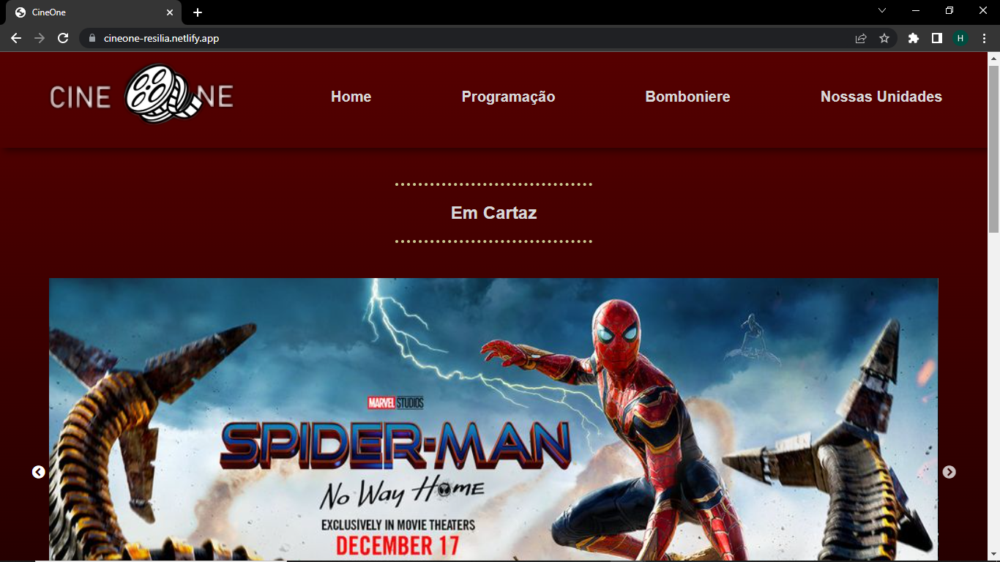
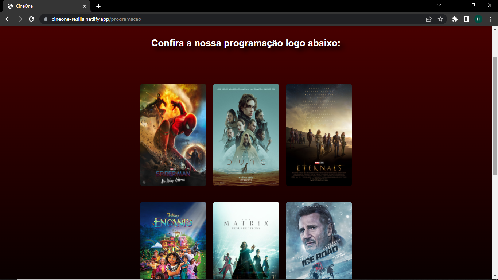
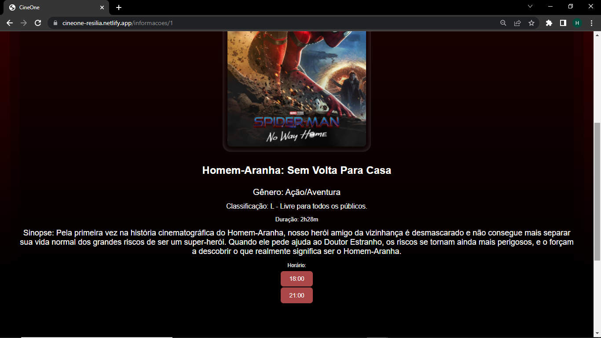
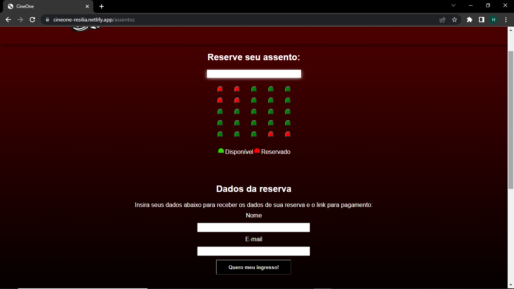
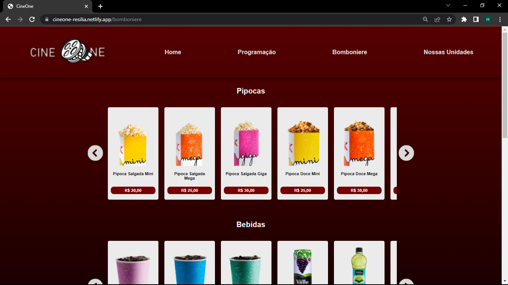
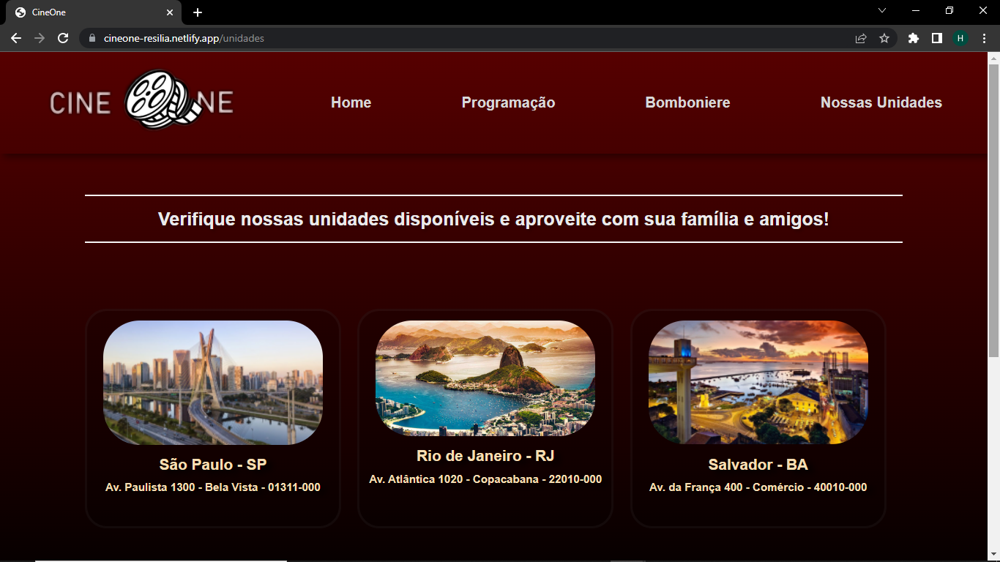

# CineOne📽️🎞🍿

## Sobre📖

Projeto desenvolvido ao fim do curso de Desenvolvimento Web FullStack da Resilia Educação. A proposta do projeto foi o desenvolvimento de um site acerca de um determinado tema, no caso, Cinema, utilizando dos conhecimentos adquiridos ao longo do curso, tanto em front-end quanto em back-end. O trabalho foi desenvolvido pela equipe: <strong>Henrique Medeiros</strong>, <strong>Luana Reis</strong>, <strong>Thais Silveira</strong> e <strong>Yara Proença</strong>.

## Link de Acesso🔗

https://cineone-resilia.netlify.app/

## Página Inicial🏠

A página inicial foi desenvolvida pela integrante <strong>Henrique Medeiros</strong>, assim como o Header e o Footer utilizados e reaproveitados em todas as páginas do site. Esses componentes foram criados utilizando como base de referência os sites de cinema já existentes, buscando manter um padrão de qualidade já visto nesses exemplos.

## Programação🎥

A página contendo a programação do cinema, assim como tudo que a circunda, foi desenvolvida pela integrante <strong>Thais Silveira</strong>. Esses componentes foram criados de modo a permitir ao usuário a visualização da listagem de filmes do cinema, assim como os detalhes e horários de cada um, e permitir que sejam feitas reservas de assentos nas salas em que esses filmes estarão sendo exibidos.
  
### Lista de Filmes🎞️  

  
### Detalhes e Horários⌚

  
### Reserva de Assentos🪑  

## Bomboniere🍿

A página de bomboniere foi desenvolvida pela integrante <strong>Luana Reis</strong>, pensando na possibilidade dos usuários optarem pela compra de lanches e acompanhamentos para os filmes através do próprio site.

## Unidades✈️

Por fim, a última página a ser desenvolvida foi a de nossas unidades, desenvolvida pela integrante <strong>Yara Proença</strong>, na qual são apresentados os estados onde estão localizadas as filiais do CineOne.

## Clonagem

Caso queira utilizar o projeto para estudos ou testes em máquina local, basta efetuar uma clonagem do repositório na máquina desejada utilizando o comando:
  
`git clone https://github.com/Henrique-Git/reactCalculator`
  
Após abrir o projeto em um editor de código de sua preferência, basta executar o comando `npm install` para que todas as dependências utilizadas no projeto sejam instaladas e o site funcione corretamente.
 
Para conferir o funcionamento do programa, basta utilizar o comando `npm start`.

## Tecnologias Utilizadas💻

<ul>
  <li>HTML</li>
  <li>CSS</li>
  <li>Javascript</li>
  <li>React.js</li>
  <li>Node.js</li>
  <li>Express.js</li>
</ul>

## Autores🤓

<li><strong>Henrique Medeiros</strong></li>

<a href="https://www.linkedin.com/in/henrique-neves-medeiros/" alt="LinkedIn" target="_blank">
    
<a>
 
  
<li><strong>Luana Reis</strong></li>

<a href="https://www.linkedin.com/in/reisluanag/" alt="LinkedIn" target="_blank">
    
<a>
 
  
<li><strong>Thais Silveira</strong></li>

<a href="https://www.linkedin.com/in/thaissilveira14/" alt="LinkedIn" target="_blank">
    
<a>
 
  
<li><strong>Yara Proença</strong></li>

<a href="https://www.linkedin.com/in/yaraproenca/" alt="LinkedIn" target="_blank">
    
<a>
